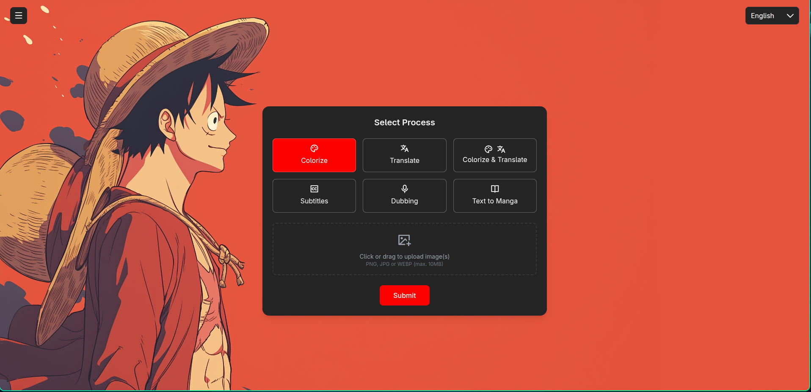
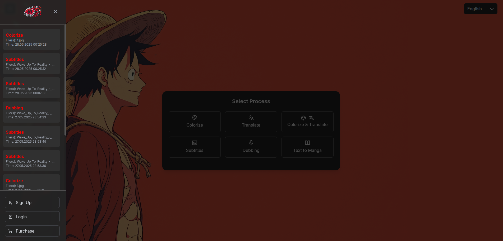

<div align="center">

# Evoars: Advanced AI Media Processing Platform

**⭐ If you find this project useful, give it a star! / Bu projeyi yararlı buluyorsanız yıldızlayın! ⭐**

[](https://github.com/koesan/Evoars)
[](https://github.com/koesan/Evoars/fork)

[](https://www.python.org/)
[](https://flask.palletsprojects.com/)
[](https://pytorch.org/)
[](https://www.docker.com/)
[](https://www.apache.org/licenses/LICENSE-2.0)

|  |  |
|:---:|:---:|

[](https://github.com/koesan/Evoars/blob/main/images/Demo.mp4)

## 📎 Live Demo - Canlı Demo

[](https://huggingface.co/spaces/koesan/mangaspaces)

**🇬🇧 Try the previous version of Evoars on Hugging Face (CPU-based, processing may be slower)**  
**🇹🇷 Evoars'ın önceki sürümünü Hugging Face'te test edin (CPU tabanlı, işlem daha yavaş olabilir)**

These repositories contain earlier versions of the project (archived/previous work):

[Manga Comic Colorization and Translation v2](https://github.com/koesan/Manga_Comic_Colorization_and_Translation_v2)

[manga_cizgi_roman_ceviri_v1](https://github.com/koesan/manga_cizgi_roman_ceviri_v1)

---

🇬🇧[English](#english) | 🇹🇷[Türkçe](#türkçe)

</div>

---

## English

### 🇬🇧

### 📖 Overview

**Evoars** is an AI-powered web platform that fully automates the processing of manga, comics, and videos. Using advanced AI techniques, it colorizes manga and comics, translates them into different languages, generates automatic subtitles for videos, and creates dubbed audio by cloning voices. Developed by leveraging open-source projects and models, Evoars offers a modern, flexible, and comprehensive solution for content creation and processing.

### ✨ Core Features & How They Work

#### 🎨 1. Manga and Comics Colorization
**Process**: Transforms black-and-white manga pages into vibrant colored artwork using deep learning neural networks.

**Technical Implementation**:
- Loads pre-trained AI colorization models (`generator.zip`)
- Processes images through PyTorch-based neural networks
- Maintains original image quality and details
- Optimizes output for natural color distribution

#### 🌐 2. Manga and Comics Translation
**Process**: Automatically detects, extracts, and translates all text elements on manga pages.

**Technical Implementation**:
1. **Text Detection**: Uses PaddleOCR to identify all text regions on the page
2. **Text Grouping**: Custom algorithm groups nearby text elements into sentences using coordinate proximity
3. **Text Processing**: Handles hyphenated words and text formatting issues
4. **Translation**: DeepL API translates processed text to target language
5. **Text Removal**: LAMA inpainting AI intelligently removes original text
6. **Text Placement**: Positions translated text naturally within original speech bubbles

#### 🔄 3. Combined Processing (Colorization + Translation)
**Process**: Performs both colorization and translation in a single optimized workflow.

**Technical Implementation**:
- First applies the complete translation process
- Then processes the translated image through colorization
- Ensures text legibility on colored backgrounds
- Maintains visual consistency throughout the process

#### 🎬 4. Video Subtitling
**Process**: Generates subtitle files from video audio using advanced speech recognition.

**Technical Implementation**:
1. **Audio Extraction**: MoviePy extracts audio track from video
2. **Speech Recognition**: OpenAI Whisper transcribes audio to text with timestamps
3. **Translation**: DeepL API translates transcript to target language
4. **SRT Generation**: Creates properly formatted subtitle files with time codes

#### 🎙️ 5. AI Dubbing
**Process**: Creates natural-sounding voiceovers in multiple languages with voice cloning.

**Technical Implementation**:
1. **Audio Analysis**: Extracts original speaker voices from video
2. **Voice Cloning**: TTS model learns speaker characteristics
3. **Text Processing**: Uses translated subtitles as dubbing script
4. **Voice Synthesis**: Generates new audio using cloned voices
5. **Audio Synchronization**: Matches timing with original video
6. **Video Integration**: Replaces original audio with dubbed version

### 🛠️ Technology Stack

**Core**: Python 3.10, Flask 3.1.0, SQLite  
**AI/ML**: PyTorch 2.2.2, PaddleOCR, OpenAI Whisper, TTS, LAMA Inpainting  
**Media**: OpenCV, FFmpeg, MoviePy, Pydub  
**UI**: HTML5, TailwindCSS, JavaScript  
**Deployment**: Docker with NVIDIA CUDA 12.1 support

### 🚀 Installation & Setup

#### Prerequisites
- **Docker** (recommended for easy setup)
- **Python 3.10+** (for manual installation)
- **DeepL API Key** (free tier available)

#### Option 1: Docker Installation (Recommended)

1. **Clone Repository**
```bash
git clone https://github.com/koesan/Evoars.git
cd Evoars
```

2. **Download AI Models**
   
   Download the required AI models for manga colorization:
   - Get `generator.zip` from [Google Drive](https://drive.google.com/file/d/1qmxUEKADkEM4iYLp1fpPLLKnfZ6tcF-t/view)
   - Extract the contents to the `networks/` folder in your project directory

3. **Configure Translation API**
   
   You need to update the DeepL API key in **two files**:
   
   **File 1: `translate.py` (line 128)**
   ```python
   translator = deepl.Translator("YOUR_DEEPL_API_KEY_HERE")
   ```
   
   **File 2: `colorize_and_translate.py` (line 129)**
   ```python
   translator = deepl.Translator("YOUR_DEEPL_API_KEY_HERE")
   ```
   
   📝 **Get your DeepL API key**: Visit [DeepL API](https://www.deepl.com/pro-api) to obtain your free API key.

4. **Build and Run**
```bash
# Build Docker image
docker build -t evoars .

# Run container (with GPU support)
docker run -p 7860:7860 --gpus all evoars

# Run container (CPU only)
docker run -p 7860:7860 evoars
```

5. **Access Application**
   
   Open your browser and navigate to: **http://localhost:7860**

#### Option 2: Manual Installation

1. **Clone and Setup**
```bash
git clone https://github.com/koesan/Evoars.git
cd Evoars
```

2. **Install Dependencies**
```bash
pip install -r requirements.txt
```

3. **Download AI Models**
   
   Download and extract `generator.zip` to the `networks/` folder as described above.

4. **Configure API Keys**
   
   Edit both `translate.py` and `colorize_and_translate.py` files to replace the DeepL API keys as shown in the Docker installation section.

5. **Run Application**
```bash
python app.py
```

### 💡 Usage Guide

**Manga Colorization = Choose **Colorize** → Upload black-and-white manga → Submit** 

**Manga Translation = Choose **Translate** → Upload manga → Select source & target languages → Submit**  

**Combined (Color + Translate) = Choose **Both** → Upload manga → Set languages → Submit** 

**Video Subtitling = Choose **Subtitle** → Upload video → Select source language → Submit** 

**AI Dubbing = Choose **Dubbing** → Upload video + SRT file → Choose Sourch & target language → Submit**

---

## Türkçe

### 🇹🇷 

### 📖 Genel Bakış

**Evoars**, manga, çizgi roman ve video işleme süreçlerini tamamen otomatikleştiren yapay zekâ destekli bir web platformudur. Yapay zekâ tekniklerini kullanarak manga ve çizgi romanları renklendirir, farklı dillere çevirir; videolara otomatik altyazı ekler ve videolardaki sesleri klonlayarak dublaj oluşturur. Açık kaynaklı projeler ve modellerden yararlanarak geliştirilmiş modern, esnek ve kapsamlı bir içerik işleme çözümüdür.

### ✨ Temel Özellikler ve Nasıl Çalışır

#### 🎨 1. Manga ve Çizgi Roman Renklendirme
**İşlem**: Derin öğrenme sinir ağları kullanarak siyah-beyaz manga sayfalarını canlı renkli sanat eserlerine dönüştürür.

#### 🌐 2. Manga ve Çizgi Roman Çevirisi
**İşlem**: Manga sayfalarındaki tüm metin öğelerini otomatik olarak algılar, çıkarır ve çevirir.

**Teknik Uygulama**:
1. **Metin Algılama**: PaddleOCR kullanarak sayfadaki tüm metin bölgelerini tanımlar
2. **Metin Gruplama**: Özel algoritma koordinat yakınlığını kullanarak yakın metin öğelerini cümlelere gruplar
3. **Metin İşleme**: Tire ile bölünmüş kelimeler ve metin biçimlendirme sorunlarını ele alır
4. **Çeviri**: DeepL API işlenmiş metni hedef dile çevirir
5. **Metin Kaldırma**: LAMA inpainting AI orijinal metni akıllıca kaldırır
6. **Metin Yerleştirme**: Çevrilmiş metni orijinal konuşma balonları içinde doğal olarak konumlandırır

#### 🔄 3. Birleşik İşleme (Renklendirme + Çeviri)
**İşlem**: Tek bir optimize edilmiş iş akışında hem renklendirme hem de çeviri gerçekleştirir.

**Teknik Uygulama**:
- Önce tüm çeviri sürecini uygular
- Sonra çevrilmiş görüntüyü renklendirme işleminden geçirir
- Renkli arka planlarda metin okunabilirliğini sağlar
- Süreç boyunca görsel tutarlılığı korur

#### 🎬 4. Video Altyazılama
**İşlem**: Gelişmiş konuşma tanıma kullanarak video sesinden altyazı dosyaları oluşturur.

**Teknik Uygulama**:
1. **Ses Çıkarma**: MoviePy video dosyasından ses parçasını çıkarır
2. **Konuşma Tanıma**: OpenAI Whisper sesi zaman damgalarıyla birlikte metne dönüştürür
3. **Çeviri**: DeepL API transkripti hedef dile çevirir
4. **SRT Oluşturma**: Zaman kodlarıyla düzgün biçimlendirilmiş altyazı dosyaları oluşturur

#### 🎙️ 5. AI Dublajı
**İşlem**: Ses klonlama ile birden fazla dilde doğal sesli seslendirmeler oluşturur.

**Teknik Uygulama**:
1. **Ses Analizi**: Videodan orijinal konuşmacı seslerini çıkarır
2. **Ses Klonlama**: TTS modeli konuşmacı özelliklerini öğrenir
3. **Metin İşleme**: Çevrilmiş altyazıları dublaj metni olarak kullanır
4. **Ses Sentezi**: Klonlanmış sesleri kullanarak yeni ses oluşturur
5. **Ses Senkronizasyonu**: Orijinal video ile zamanlamayı eşleştirir
6. **Video Entegrasyonu**: Orijinal sesi dublajlı sürümle değiştirir

### 🛠️ Teknoloji Yığını

**Temel**: Python 3.10, Flask 3.1.0, SQLite  
**AI/ML**: PyTorch 2.2.2, PaddleOCR, OpenAI Whisper, TTS, LAMA Inpainting  
**Medya**: OpenCV, FFmpeg, MoviePy, Pydub  
**UI**: HTML5, TailwindCSS, JavaScript  
**Dağıtım**: NVIDIA CUDA 12.1 destekli Docker

### 🚀 Kurulum ve Yapılandırma

#### Gereksinimler
- **Docker** (kolay kurulum için önerilir)
- **Python 3.10+** (manuel kurulum için)
- **DeepL API Key** (ücretsiz katman mevcut)

#### Seçenek 1: Docker Kurulumu (Önerilen)

1. **Depoyu Klonlayın**
```bash
git clone https://github.com/koesan/Evoars.git
cd Evoars
```

2. **AI Modellerini İndirin**
   
   Manga renklendirme için gerekli AI modellerini indirin:
   - `generator.zip` dosyasını [Google Drive](https://drive.google.com/file/d/1qmxUEKADkEM4iYLp1fpPLLKnfZ6tcF-t/view) üzerinden indirin
   - İçeriği proje dizininizdeki `networks/` klasörüne çıkarın

3. **Çeviri API'sini Yapılandırın**
   
   DeepL API anahtarını **iki dosyada** güncellemeniz gerekiyor:
   
   **Dosya 1: `translate.py` (128. satır)**
   ```python
   translator = deepl.Translator("DEEPL_API_ANAHTARINIZ")
   ```
   
   **Dosya 2: `colorize_and_translate.py` (129. satır)**
   ```python
   translator = deepl.Translator("DEEPL_API_ANAHTARINIZ")
   ```
   
   📝 **DeepL API anahtarınızı alın**: Ücretsiz API anahtarınız için [DeepL API](https://www.deepl.com/pro-api) sitesini ziyaret edin.

4. **Oluşturun ve Çalıştırın**
```bash
# Docker imajını oluşturun
docker build -t evoars .

# Container'ı çalıştırın (GPU desteği ile)
docker run -p 7860:7860 --gpus all evoars

# Container'ı çalıştırın (sadece CPU)
docker run -p 7860:7860 evoars
```

5. **Uygulamaya Erişin**
   
   Tarayıcınızı açın ve şu adrese gidin: **http://localhost:7860**

#### Seçenek 2: Manuel Kurulum

1. **Klonlayın ve Kurun**
```bash
git clone https://github.com/koesan/Evoars.git
cd Evoars
```

2. **Bağımlılıkları Yükleyin**
```bash
pip install -r requirements.txt
```

3. **AI Modellerini İndirin**
   
   Yukarıda açıklandığı gibi `generator.zip` dosyasını indirin ve `networks/` klasörüne çıkarın.

4. **API Anahtarlarını Yapılandırın**
   
   Hem `translate.py` hem de `colorize_and_translate.py` dosyalarını düzenleyin ve DeepL API anahtarlarını Docker kurulum bölümünde gösterildiği gibi değiştirin.

5. **Uygulamayı Çalıştırın**
```bash
python app.py
```

### 💡 Kullanım Kılavuzu

**Manga Renklendirme = **Colorize** seçin → Siyah-beyaz resmi yükleyin → Submit**

**Manga Çevirisi = **Translate** seçin → Manga resmini yükleyin → Kaynak & hedef dili seçin → Submit**

**Birleşik (Renk + Çeviri) = **Both** seçin → Manga resmini yükleyin → Dil ayarını yapın → Submit**

**Video Altyazılama = **Subtitle** seçin → Videoyu yükleyin → Kaynak dili seçin → Submit**

**AI Dublaj = **Dubbing** seçin → Video + SRT dosyasını yükleyin → kaynak & hedef Dili seçin → Submit**

---

## 🙏 Acknowledgements / Yararlanılan Açık Kaynak Projeler

This project builds on and uses ideas/code from the following open-source projects — big thanks to the authors:

- [manga-colorization-v2](https://github.com/qweasdd/manga-colorization-v2) — manga colorization techniques and model examples.  
- [OpenAI Whisper](https://github.com/openai/whisper) — speech-to-text ASR.  
- [whisperX](https://github.com/m-bain/whisperX) — improved Whisper alignment utilities.  
- [Coqui TTS](https://github.com/coqui-ai/TTS) — text-to-speech / voice cloning tools.  
- [LaMa (LAMA) Inpainting](https://github.com/advimman/lama) — image inpainting for text removal and repair.  
- [PaddleOCR](https://github.com/PaddlePaddle/PaddleOCR) — OCR engine for text detection/extraction.
